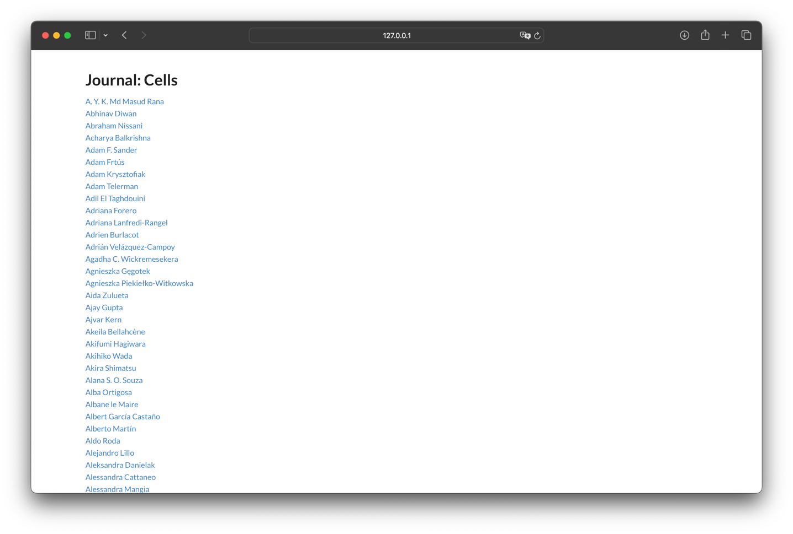
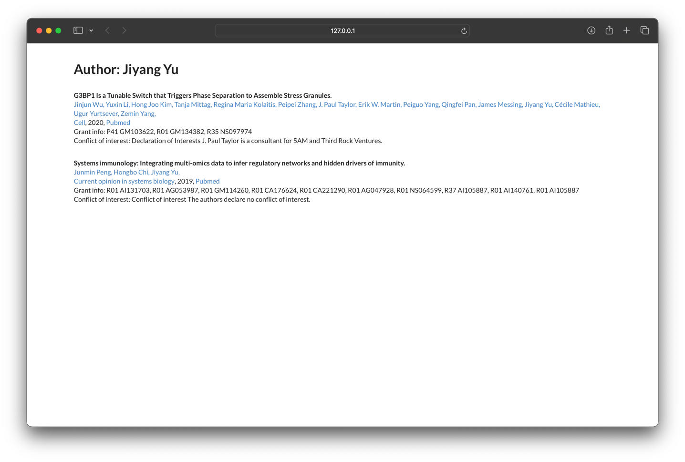

# Inf553 PubMed Web application

Chenwei Wan, Yujia Cheng

## How to run

Firstly, set database connection in `pubmed/settings.py` line 84, for example:

```python
DATABASES = {
    'default': {
        'ENGINE': 'django.db.backends.postgresql',
        'NAME': 'pubmed',
        'HOST': 'localhost',
        'PORT': '5432',
      # 'USER': ...,
      # 'PASSWORD': ...
    }
}
```

Install requirements:

```bash
pip install django django-cors-headers psycopg2
```

Run the following command:

```bash
cd pubmed && python manage.py runserver
```

Then go to http://127.0.0.1:8000

## Implementation

The backend is built with Django and the frontend is built with React separately.

If you want to build the frontend by yourself, deploy Next.js in `frontend/` and run `npm run build`. The output should be placed at `pubmed/pubmed/build`.

## Test cases

http://127.0.0.1:8000/journal/Cells



http://127.0.0.1:8000/author/1736388


